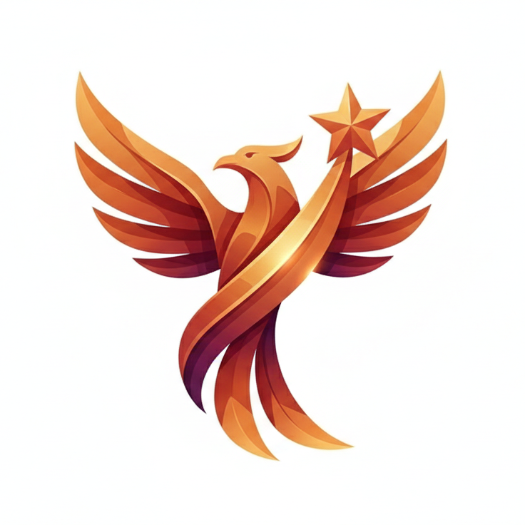

# Microsoft Rewards Bot

**Automated Microsoft Rewards point collection — choose your version below**

&nbsp;

---

## Choose Your Version

### 🚀 Latest — V4 (New Dashboard)
> Supports the new Next.js Microsoft Rewards dashboard  
> Active development · Premium features · Full automation

**[→ Go to V4 branch](https://github.com/LightZirconite/Microsoft-Rewards-Bot/tree/release)**

---

### 🗂️ Legacy — V3 (Old Dashboard)
> For the classic Microsoft Rewards dashboard  
> No longer maintained · Open source

**[→ Go to Legacy branch](https://github.com/LightZirconite/Microsoft-Rewards-Bot/tree/legacy)**

---

Not affiliated with Microsoft Corporation.

